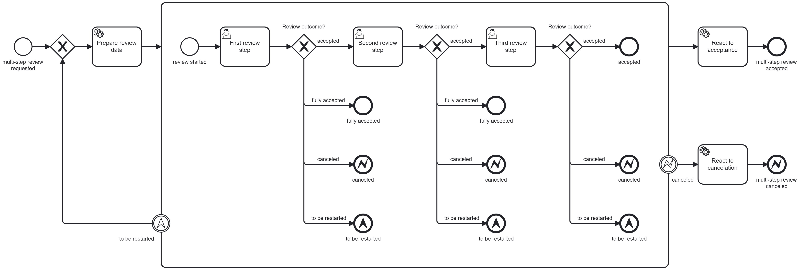

# Multi-Step Review

This multi-step review process blueprint provides the following functionalities:

- the same or different assignees, candidate groups, or candidate users can work on multiple distinct Camunda forms
- the review process can be completed after each user task
- the review process can be restarted after each user task
- the review process can be canceled after each user task
- the cancelation is propagated to the parent process via a BPMN error event
- the reviews' results can be easily analyzed in Optimize

This multi-step review process blueprint should not be used if multiple reviewers should work on the same Camunda form.

## Installation Guide

The technical configuration of the multi-step review process needs to be changed to fit your use case. This includes:

- service task types
- the forms need to provide the "outcome" process variable with values: "accepted", "fully_accepted", "to_be_restarted", and "canceled" (radio group)
- handling of cancelation error in parent process

## Adaptations

The multi-step review process blueprint can be adapted to fit different business requirements.

### Number of Steps

To change the number of steps, remove or add sections consisting of a user task and the following exclusive gateway with its outcomes.

### Mandatory Steps

To make all steps mandatory, remove the "fully accepted" outgoing sequence flows and none end events.

### Different Error Events

If the review can be not only canceled, but also rejected, etc., additional BPMN error end events with different error codes can be introduced.

### Handle Outcome in Parent Scope

The different outcomes (accepted, canceled, to_be_restarted) can also be handled in the parent scope. In this case, only the section inside the embedded subprocess is necessary, and the call activity in the parent scope that starts the review process also needs to handle the thrown escalation event.

### More Than Human Task Orchestration

This process blueprint can also be used other review- or validation-type processes that do not use user tasks. The large-scale retry mechanism via the escalation event, completion via none end events, and errors via error events are useful modeling patterns that can be used in a variety of cases.
