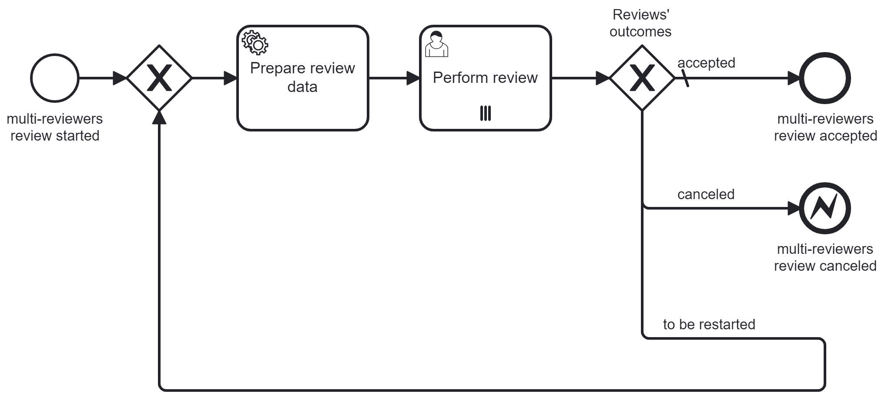

# Multi-Reviewers Review

This multi-reviewers review process blueprint provides the following functionalities:

- multiple reviewers can work on the same Camunda form in parallel
- if one reviewer determines that the review process should be fully accepted, restarted, or canceled, all active reviews are interrupted
- if one reviewer fully accepts or if all reviewers accept the review, the process completes
- the cancelation is propagated to the parent process via a BPMN error event

## Installation Guide

The technical configuration of the multi-reviewers review process needs to be changed to fit your use case. This includes:

- service task types
- the form needs to provide the "outcome" process variable with values: "accepted", "fully_accepted", "to_be_restarted", and "canceled" (radio group)
- handling of cancelation error in parent process

## Adaptations

The multi-reviewers review process blueprint can be adapted to fit different business requirements.

### Mandatory Steps

To make all reviews mandatory, remove the "fully accepted" check from the completion condition.

### Different Error Events

If the review can be not only canceled, but also rejected, etc., additional BPMN error end events with different error codes can be introduced. In this case the completion condition on the multi-instance user task needs to be adapted accordingly.

### Handle Outcome in Parent Scope

The different outcomes (accepted, canceled, to_be_restarted) can also be handled in the parent scope. In this case, the "to be restarted" outgoing sequence flow should throw an escalation event, and the call activity in the parent scope that starts the review process also needs to handle the thrown escalation event.
